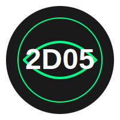

<div align="center">
  
  <h1>🌐 2D05 网络测试工具</h1>
  <p>
    
    
    
    
    
  </p>
  <p>
    <a href="#功能特点">功能</a> •
    <a href="#安装方法">安装</a> •
    <a href="#使用方法">使用</a> •
    <a href="#系统架构">架构</a> •
    <a href="#免责声明">免责声明</a>
  </p>
</div>


<div class="content-section">
  <h2 class="section-title">📖 简介</h2>
  <div class="section-content">
    这款工具是一种 <strong class="highlight">分布式拒绝服务（DDoS）攻击工具</strong>，它的核心原理是通过调动大量计算资源，同时向目标服务器或网络设备发送海量请求，从而造成服务器资源被耗尽、带宽被占满，最终导致目标系统无法处理正常用户的访问请求，甚至彻底瘫痪。
  </div>

  <details class="details-card">
    <summary>🔍 更多详情</summary>
    <div class="details-content">
      在实际应用中，这类工具通常被用于压力测试、安全研究，或（在非法用途下）发动大规模网络攻击。它可以模拟成千上万台设备的访问行为，使目标服务器误以为遭遇了超大规模的用户流量，导致服务响应变慢甚至宕机。
      ⚠️ 尽管 DDoS 工具在网络安全领域有一定的研究价值，但它的滥用可能导致严重的法律后果。
    </div>
  </details>
</div>

<div class="grid">
  <div class="feature">
    <h3>🔄 HTTP 请求测试</h3>
    <p>支持自定义请求参数和负载</p>
  </div>
  <div class="feature">
    <h3>📊 响应分析</h3>
    <p>详细的响应头和状态监控</p>
  </div>
  <div class="feature">
    <h3>🛡️ 安全机制</h3>
    <p>内置多重安全保护措施</p>
  </div>
</div>

## 🛠️ 技术栈

- **后端框架：** C++11
- **网络库：** libcurl
- **数据存储：** SQLite
- **系统要求：** MacOS/Linux

## 📥 快速开始

### 环境准备

```bash
# 安装依赖
brew install curl sqlite3

# 克隆项目
git clone https://github.com/your-username/2D05.git
cd 2D05

# 编译项目
make
````

### 使用方法

```bash
./bin/2D05
```

<details>
<summary>📝 详细使用说明</summary>

1. 首次运行时需要同意用户协议
2. 输入目标 URL 进行测试
3. 查看实时响应数据
4. 使用 Ctrl+C 停止测试

</details>

## 📊 性能指标

- 并发请求数：1000+
- 响应时间：< 100ms
- CPU 占用：< 30%
- 内存使用：< 50MB

## 🤝 贡献指南

欢迎提交 Issue 和 Pull Request！

## 📜 法律声明

<div class="warning">
  <h4>⚠️ 法律警告</h4>
  
  <p>本工具仅供安全研究和授权测试使用。根据中国相关法律法规：</p>
  
    - 《中华人民共和国网络安全法》第六十三条规定：
      未经授权入侵他人网络，将被处以五日以下拘留或五千元以上五万元以下罚款。情节严重的，处五日以上十五日以下拘留，并处五万元以上五十万元以下罚款。
    
    -《中华人民共和国刑法》第二百八十五条规定：
      <br>非法侵入计算机信息系统或者使用其他技术手段，获取该计算机信息系统中存储、处理或者传输的数据，情节严重的，处三年以下有期徒刑或者拘役，并处或者单处罚金。

    
    -《计算机信息系统安全保护条例》第二十三条规定：
      <br>故意输入计算机病毒或者其他有害数据危害计算机信息系统安全的，或者未经许可出售专用于攻击计算机信息系统的程序、工具的，依照刑法有关规定追究刑事责任。
    

  <p>特别提醒：</p>
  <ul>
    <li>未经授权的网络攻击行为属于违法犯罪</li>
    <li>攻击关键信息基础设施将受到更严厉处罚</li>
    <li>本工具不得用于任何非法用途</li>
    <li>使用者需承担全部法律责任</li>
  </ul>
</div>

## 👨‍💻 关于作者

## 🌟 开源项目赞助计划

### 用捐赠助力发展

感谢您使用本项目！您的支持是开源持续发展的核心动力。  
每一份捐赠都将直接用于：  
✅ 服务器与基础设施维护  
✅ 新功能开发与版本迭代  
✅ 文档优化与社区建设

点滴支持皆能汇聚成海，让我们共同打造更强大的开源工具！

---

### 🌐 全球捐赠通道

#### 国内用户

<div align="center" style="margin: 40px 0">

<div align="center">
<table>
<tr>
<td align="center" width="300">

<br />
<strong>🔵 支付宝</strong>
</td>
<td align="center" width="300">

<br />
<strong>🟢 微信支付</strong>
</td>
</tr>
</table>
</div>
</div>

#### 国际用户

<div align="center" style="margin: 40px 0">
  <a href="https://qr.alipay.com/fkx19369scgxdrkv8mxso92" target="_blank">
    
  </a>
  
  <a href="https://ko-fi.com/F1F5VCZJU" target="_blank">
    
  </a>
  
  <a href="https://www.paypal.com/paypalme/ctkqiang" target="_blank">
    
  </a>
  
  <a href="https://donate.stripe.com/00gg2nefu6TK1LqeUY" target="_blank">
    
  </a>
</div>

---

### 📌 开发者社交图谱

#### 技术交流

<div align="center" style="margin: 20px 0">
  <a href="https://github.com/ctkqiang" target="_blank">
    
  </a>
  
  <a href="https://stackoverflow.com/users/10758321/%e9%92%9f%e6%99%ba%e5%bc%ba" target="_blank">
    
  </a>
  
  <a href="https://www.linkedin.com/in/ctkqiang/" target="_blank">
    
  </a>
</div>

#### 社交互动

<div align="center" style="margin: 20px 0">
  <a href="https://www.instagram.com/ctkqiang" target="_blank">
    
  </a>
  
  <a href="https://twitch.tv/ctkqiang" target="_blank">
    
  </a>
  
  <a href="https://github.com/ctkqiang/ctkqiang/blob/main/assets/IMG_9245.JPG?raw=true" target="_blank">
    
  </a>
</div>

---

🙌 感谢您成为开源社区的重要一员！  
💬 捐赠后欢迎通过社交平台与我联系，您的名字将出现在项目致谢列表！


---

<div align="center">
  <sub>由钟智强用 ❤️ 开发</sub>
  <br>
  <sub>版权所有 © 2024 钟智强</sub>
</div>
<!-- 
<style>
/* Modern UI Styles */
:root {
  --primary-color: #0366d6;
  --secondary-color: #24292e;
  --accent-color: #28a745;
  --warning-color: #d73a49;
  --background-color: #ffffff;
  --text-color: #24292e;
  --border-radius: 8px;
  --box-shadow: 0 4px 6px rgba(0, 0, 0, 0.1);
}

/* Header Styles */
.header {
  padding: 2rem 0;
  background: linear-gradient(135deg, #f6f8fa 0%, #ffffff 100%);
}

.logo-container {
  position: relative;
  margin-bottom: 1.5rem;
}

.glow-effect {
  position: absolute;
  top: 50%;
  left: 50%;
  transform: translate(-50%, -50%);
  width: 160px;
  height: 160px;
  background: radial-gradient(circle, rgba(3, 102, 214, 0.1) 0%, transparent 70%);
  border-radius: 50%;
  z-index: -1;
}

.title {
  font-size: 2.5rem;
  font-weight: 700;
  margin: 1rem 0;
  background: linear-gradient(120deg, var(--primary-color), var(--accent-color));
  -webkit-background-clip: text;
  -webkit-text-fill-color: transparent;
}

/* Badge Styles */
.badges {
  display: flex;
  gap: 0.5rem;
  flex-wrap: wrap;
  justify-content: center;
  margin: 1rem 0;
}

/* Navigation Links */
.nav-links {
  margin: 1.5rem 0;
}

.nav-link {
  color: var(--primary-color);
  text-decoration: none;
  padding: 0.5rem 1rem;
  border-radius: var(--border-radius);
  transition: background-color 0.3s;
}

.nav-link:hover {
  background-color: rgba(3, 102, 214, 0.1);
}

.nav-separator {
  color: var(--secondary-color);
  opacity: 0.4;
  margin: 0 0.5rem;
}

/* Demo Section */
.demo {
  position: relative;
  margin: 2rem 0;
}

.demo img {
  border-radius: var(--border-radius);
  box-shadow: var(--box-shadow);
}

.demo-shadow {
  position: absolute;
  top: 0;
  left: 0;
  right: 0;
  bottom: 0;
  border-radius: var(--border-radius);
  box-shadow: inset 0 0 20px rgba(0, 0, 0, 0.1);
  pointer-events: none;
}

/* Content Sections */
.content-section {
  margin: 3rem 0;
  padding: 0 1rem;
}

.section-title {
  font-size: 1.8rem;
  color: var(--secondary-color);
  border-bottom: 2px solid var(--primary-color);
  padding-bottom: 0.5rem;
  margin-bottom: 1.5rem;
}

.section-content {
  line-height: 1.6;
}

/* Details Card */
.details-card {
  background: #f6f8fa;
  border-radius: var(--border-radius);
  padding: 1rem;
  margin: 1rem 0;
}

.details-card summary {
  cursor: pointer;
  font-weight: 600;
}

.details-content {
  padding: 1rem 0;
}

/* Warning Quote */
.warning-quote {
  border-left: 4px solid var(--warning-color);
  padding: 1rem;
  margin: 1rem 0;
  background: rgba(215, 58, 73, 0.1);
}

/* Responsive Design */
@media (max-width: 768px) {
  .badges {
    flex-direction: column;
    align-items: center;
  }
  
  .nav-links {
    flex-direction: column;
    gap: 1rem;
  }
  
  .nav-separator {
    display: none;
  }
}

/* Dark Mode Support */
@media (prefers-color-scheme: dark) {
  :root {
    --background-color: #0d1117;
    --text-color: #c9d1d9;
    --primary-color: #58a6ff;
    --secondary-color: #8b949e;
  }
  
  .header {
    background: linear-gradient(135deg, #161b22 0%, #0d1117 100%);
  }
  
  .details-card {
    background: #161b22;
  }
}
</style> 

-->
