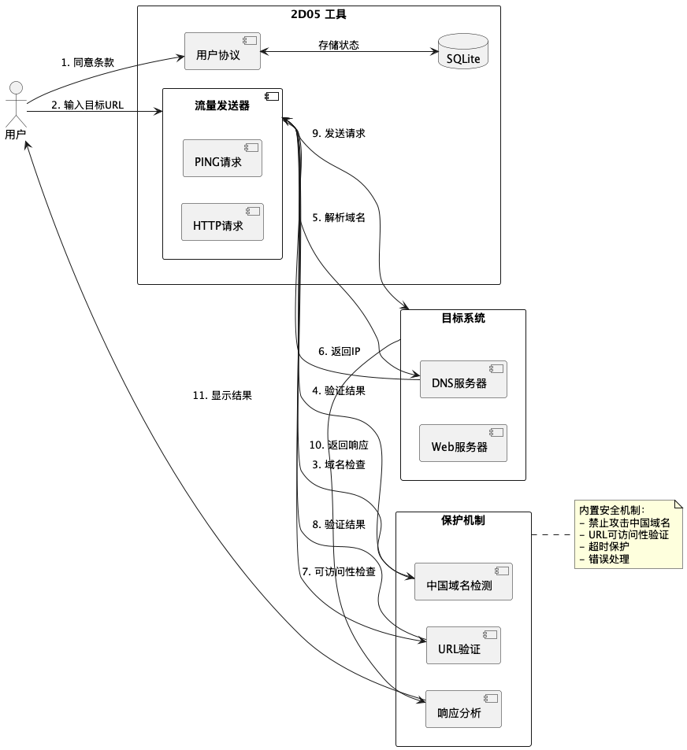

<div align="center">
  <h1>🌐 2D05 网络测试工具</h1>
  <p>
    
    
    
  </p>
</div>

## 📖 简介

这款工具是一种 **分布式拒绝服务（DDoS）攻击工具**，它的核心原理是通过调动大量计算资源，同时向目标服务器或网络设备发送海量请求，从而造成服务器资源被耗尽、带宽被占满，最终导致目标系统无法处理正常用户的访问请求，甚至彻底瘫痪。

## 🏗️ 系统架构

<div align="center">
  
</div>

#### 系统主要由以下组件构成：

- 🔐 用户协议管理
- 🌊 流量发送器（HTTP/PING）
- 🛡️ 安全保护机制
- 📝 响应分析系统
- 🗄️ 状态存储（SQLite）


## 🔍 工作原理

在实际应用中，这类工具通常被用于压力测试、安全研究，或（在非法用途下）发动大规模网络攻击。它可以模拟成千上万台设备的访问行为，使目标服务器误以为遭遇了超大规模的用户流量，导致服务响应变慢甚至宕机。

> ⚠️ 尽管 DDoS 工具在网络安全领域有一定的研究价值，但它的滥用可能导致严重的法律后果。因此，在使用此类工具时，必须确保遵守相关法律法规，并仅用于授权测试或防御研究，而非恶意攻击行为。

## ⚡ 功能特点

- 🔄 HTTP 请求测试
- 📊 响应头分析
- 🍪 Cookie 检查
- 📝 内容类型验证
- 📈 状态码监控

## 🛠️ 依赖项

- [libcurl](https://curl.se/libcurl/) - 强大的网络请求库
- C++11 或更高版本

## 📥 安装方法

1. 安装依赖：
```bash
brew install curl
````

2. 编译项目：

```bash
clang++ -std=c++11 -o bin/2D05 main.cpp src/Controller/TrafficFlood.cpp -lcurl
```

## 🚀 使用方法

```bash
./bin/2D05
```

## ⚠️ 免责声明

<details>
<summary>点击展开查看完整免责声明</summary>

作为本软件的作者，我明确声明：本软件仅用于合法、合规、合理的用途。任何用户使用本软件执行的操作均由用户自行承担责任。本人不对任何因使用本软件而导致的直接或间接损害、法律责任、经济损失、数据丢失或其他任何后果承担责任。

</details>

## 📜 法律警告

<details>
<summary>点击展开查看法律警告</summary>

本软件仅供合法用途，任何滥用均由用户自行承担责任，作者概不负责。根据《中华人民共和国网络安全法》《中华人民共和国刑法》《计算机信息系统安全保护条例》等法律，未经授权入侵计算机系统、传播恶意软件、窃取数据、进行网络诈骗、攻击关键信息基础设施等行为均属违法，违法者可被判处最高七年以上有期徒刑，并处以罚金或财产没收。

</details>

## 📄 开源协议

本项目采用 [MIT](LICENSE) 许可证

## 👨‍💻 作者

**钟智强**

---

<div align="center">
  <sub>由钟智强用 ❤️ 开发</sub>
</div>